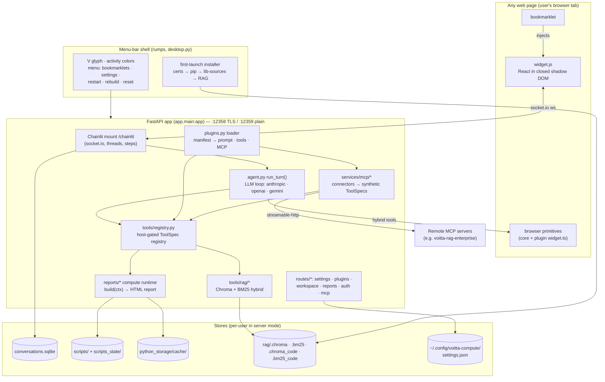
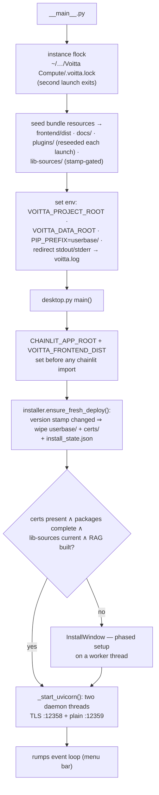
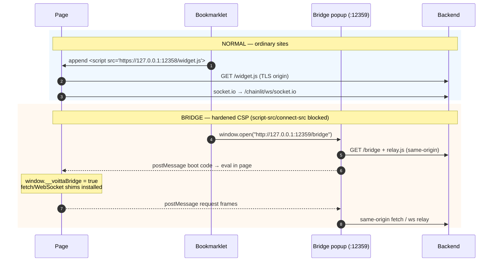
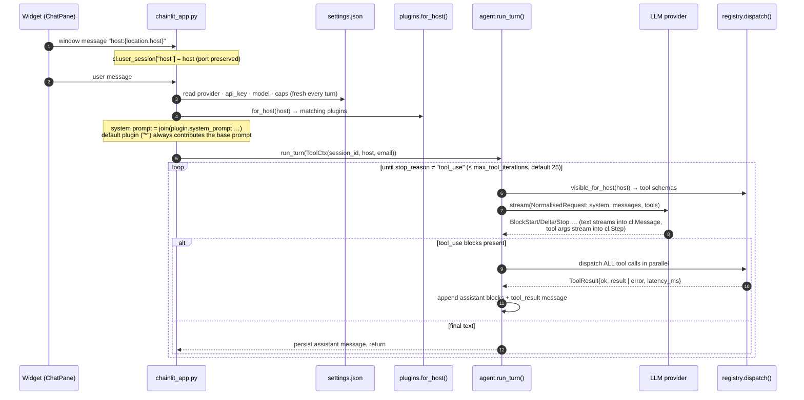
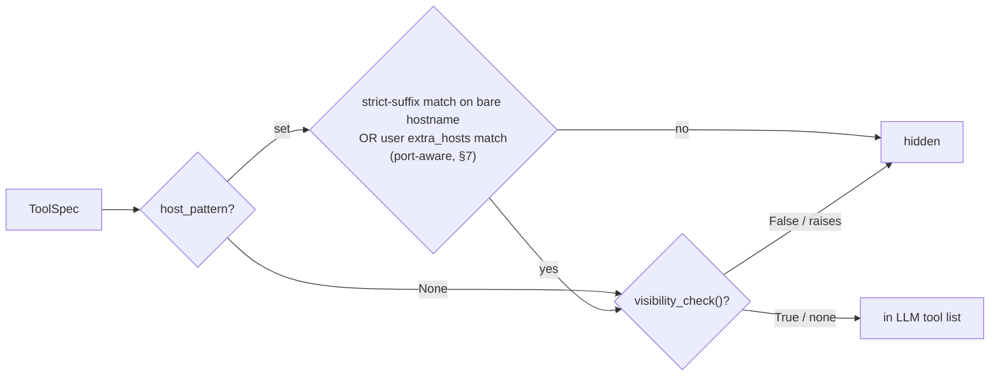
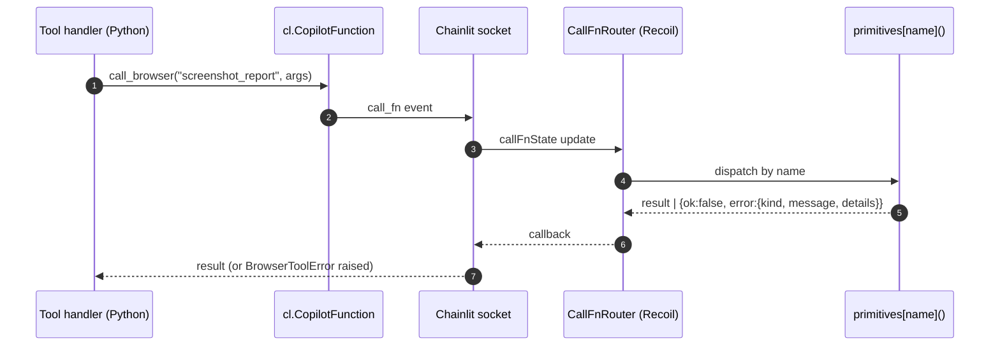
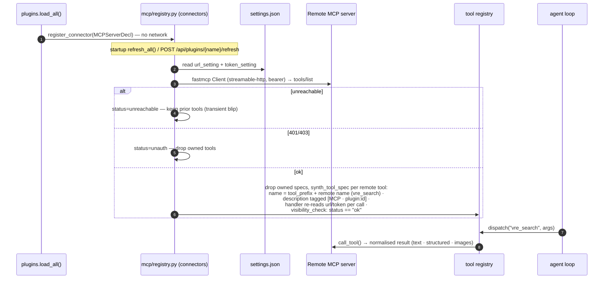
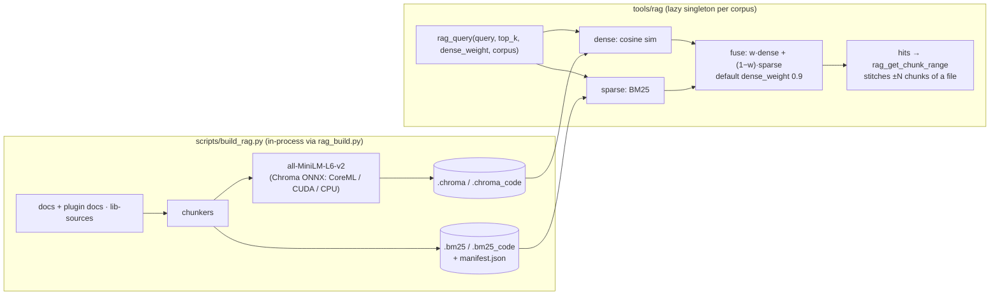
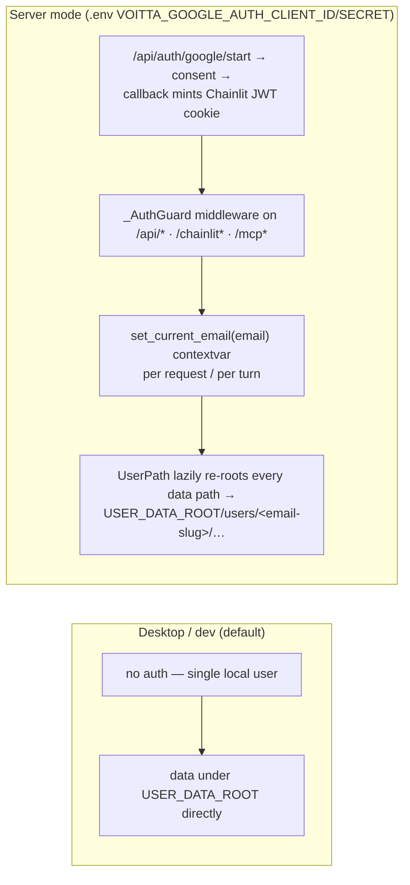

# Voitta Compute — Operations & Data Flow

> A detailed, diagram-first walkthrough of how the system actually works at
> runtime: the menu-bar shell and first-launch installer, TLS + bookmarklet
> delivery, the chat turn and agent loop, tool registry and dispatch, the
> hybrid browser round-trip, plugins and MCP connectors, the scripts/reports
> compute runtime, python_storage, the RAG indexes, settings, persistence,
> and packaging.
>
> Diagrams are [Mermaid](https://mermaid.js.org/). GitHub, VS Code (with the
> Mermaid extension), and most markdown viewers render them inline.

## Contents

1. [System overview](#1-system-overview)
2. [Process lifecycle: menu-bar shell & installer](#2-process-lifecycle-menu-bar-shell--installer)
3. [Ports, TLS & bookmarklet delivery](#3-ports-tls--bookmarklet-delivery)
4. [The chat turn: from page host to agent loop](#4-the-chat-turn-from-page-host-to-agent-loop)
5. [Tool registry & dispatch](#5-tool-registry--dispatch)
6. [Browser primitives: the hybrid round-trip](#6-browser-primitives-the-hybrid-round-trip)
7. [Plugin system](#7-plugin-system)
8. [MCP connectors](#8-mcp-connectors)
9. [Scripts & reports: the compute runtime](#9-scripts--reports-the-compute-runtime)
10. [Workspace & python_storage](#10-workspace--python_storage)
11. [RAG subsystem](#11-rag-subsystem)
12. [Settings & persistence](#12-settings--persistence)
13. [Embedded MCP debug server](#13-embedded-mcp-debug-server)
14. [Paths, env vars & logging](#14-paths-env-vars--logging)
15. [Packaging & release](#15-packaging--release)

---

## 1. System overview

Voitta Compute is a macOS menu-bar app ([backend/app/desktop.py](backend/app/desktop.py),
`rumps`) that hosts a single FastAPI/Chainlit ASGI app
([backend/app/main.py](backend/app/main.py)) on two local listeners — TLS on
`127.0.0.1:12358` and plain-HTTP on `127.0.0.1:12359`. A **bookmarklet**
injects a self-contained React widget (`widget.js`) into any page the user is
on; the widget opens a Chainlit websocket back to the local backend, where an
LLM **agent loop** runs chat turns with a host-gated tool registry. Tools are
either *server-side* (Python: scripts, RAG, storage) or *hybrid* (round-trip
into the user's browser tab: `browser_eval`, screenshots, plugin scrapers).
Plugins extend every layer — system prompt, Python tools, browser primitives,
settings panels, and remote **MCP servers** whose tools get prefixed and
merged into the same registry.



**Key invariants:**

- The backend binds **loopback only** — nothing is reachable from the network.
  Server deployments (multi-user) add Google-OAuth auth and per-user data
  isolation on the same codebase.
- Tool visibility is recomputed **every turn** from the page host
  (`registry.visible_for_host`), so what the LLM can call depends on which
  site the bookmarklet was clicked on.
- Settings are re-read from disk **per turn / per call** (no restart needed
  for provider, model, API key, or MCP credential changes).
- The script runtime is a **power tool, not a sandbox** — user scripts run
  with full Python builtins in the backend process (thread-pooled, 120 s
  timeout).

---

## 2. Process lifecycle: menu-bar shell & installer

### Boot sequence

Entry point in the frozen `.app` is
[src/voitta_compute/\_\_main\_\_.py](src/voitta_compute/__main__.py); dev mode
runs uvicorn directly via [start.sh](start.sh).



### First-launch installer phases

The `.app` bundles only lightweight boot deps (FastAPI, uvicorn, rumps,
pyobjc, pip). Everything heavy is installed at first launch into a user-owned
`userbase/` prefix — keeps the bundle small and the heavy deps upgradeable
without re-notarising.

| Phase | Check | Action | Where it lands |
|-------|-------|--------|----------------|
| 0 Certificates | `certs.is_present()` | `mkcert -install` + `mkcert 127.0.0.1 localhost` (bundled mkcert binary preferred) | `<PROJECT_ROOT>/certs/127.0.0.1+1{,-key}.pem` |
| 1 Python packages | `installer.is_complete()` (install_state.json) | pip-install `_CORE_HEAVY_PACKAGES` (fastmcp, chainlit, anthropic, openai, google-genai, numpy, pandas, scipy, matplotlib, plotly, chromadb, bm25s, sqlalchemy, …) + plugin-declared deps, `--find-links` bundled wheels | `userbase/lib/python3.x/site-packages` (PIP_PREFIX) |
| 2 Source libraries | `installer.lib_sources_need_update()` (SHA stamp vs bundled `code_sources_version.txt`) | shallow-clone the pinned submodules | `<data>/lib-sources/` (elk, elkjs, jinja, three.js) |
| 3 RAG indexes | `rag_build.is_built()` (content/SHA stamps) | run [scripts/build_rag.py](scripts/build_rag.py) in-process via `runpy` | `<PROJECT_ROOT.parent>/rag/` |

Version-gated wipe ([backend/app/installer.py](backend/app/installer.py)
`ensure_fresh_deploy`): when `.deployed_version` ≠ the running version, the
shell wipes `userbase/`, `backend/certs/`, and `install_state.json` so phases
0–1 re-run cleanly. The RAG index is **not** wiped — its own content stamps
decide whether a rebuild is needed.

### Tray menu

| Item | Action |
|------|--------|
| About Voitta | version + brand text |
| Open in browser | `https://127.0.0.1:12358` (http fallback if no certs) |
| Copy bookmarklet | normal injector (most sites) |
| Copy bookmarklet (Salesforce/strict CSP) | bridge/popup variant — see §3 |
| Settings… | server URL, TLS/RAG/plugins/MCP status, **MCP-debug toggle** (§13) |
| Server: status / Restart server | `should_exit` → 1.5 s port-free pause → relaunch threads |
| Workspace… | opens `{server_url}?workspace=1` |
| (Re)create TLS certificates… | interactive mkcert re-run, prompts restart |
| Rebuild… | clears install stamps → installer phases re-run |
| Reset… | deletes `rag/`, `scripts_state/`, `python_storage/`, `settings.json` |
| Quit Voitta | exit (daemon threads reap with the process) |

The glyph is always **"V"**, colored by the topmost active tool category
([backend/app/activity.py](backend/app/activity.py)): red `error`/`code_edit`,
purple `compute`, blue `report`, yellow `drive_download`, green `rag`, orange
`web`, gray `generic`. Tool dispatch brackets every handler with
`activity.begin/end`, and the tray polls at 0.4 s.

---

## 3. Ports, TLS & bookmarklet delivery

| Listener | Port | Purpose |
|----------|------|---------|
| TLS | `127.0.0.1:12358` (`PORT`, [backend/app/config.py](backend/app/config.py)) | primary origin — `https:` so the widget is a Secure Context on https pages (no mixed-content blocks) |
| Plain HTTP | `127.0.0.1:12359` (`PLAINTEXT_PORT`) | bridge popup for hardened-CSP sites (localhost http is still a Secure Context) |

Both listeners serve the **same ASGI app**. TLS uses mkcert-issued certs for
`127.0.0.1` + `localhost`, signed by a local CA that `mkcert -install` puts in
the system trust store — the private key never leaves the machine.

### Widget serving

`widget.js` is a single ~3.6 MB IIFE bundle (Vite lib build,
`inlineDynamicImports: true` — a bookmarklet can only inject one file). The
FastAPI catch-all route serves files from `FRONTEND_DIST`
(env `VOITTA_FRONTEND_DIST`, dev fallback `frontend/dist/`) with
`no-cache` headers, falling back to `index.html`, then to `widget.js` itself.

### Two bookmarklets ([backend/app/bookmarklets.py](backend/app/bookmarklets.py))



- The widget derives its backend origin from `window.__voittaBackendOrigin`
  (bridge), else `document.currentScript.src`, else `location.origin`
  ([frontend/src/widget.tsx](frontend/src/widget.tsx)).
- Under the bridge, the Chainlit client is forced WebSocket-only (XHR polling
  isn't shimmed) and chat images are fetched into `blob:` URLs to dodge
  `img-src` CSP ([frontend/src/chat/BridgeImg.tsx](frontend/src/chat/BridgeImg.tsx)).
- The widget mounts in a **closed shadow DOM** under a fixed host element
  (`#voitta-compute-host`, z-index 2147483647); all CSS is inlined into one
  `<style>` node, themes switch via `data-theme`, layout (`chat-left`/
  `chat-right`) via `data-layout`. Browser-side primitives that need DOM
  access get the shadow root through `window.VoittaBookmarklet.getShadowRoot()`.

### HTTP plumbing quirks ([backend/app/main.py](backend/app/main.py))

Three non-obvious pieces keep cross-origin loopback traffic alive:

- **Chrome Private Network Access**: a raw ASGI middleware short-circuits
  combined CORS+PNA preflights *before* CORSMiddleware (which would never
  echo `Access-Control-Allow-Private-Network`) and stamps the header on every
  response — without it, modern Chrome blocks public-site → 127.0.0.1
  requests with `net::ERR_FAILED`.
- **engineio tuning**: `max_decode_packets` is raised 16 → 128 after the
  Chainlit import (multi-MB screenshot frames arrive as packet bursts that
  would otherwise be dropped); a companion patch
  ([backend/app/services/_bokeh_ws_patch.py](backend/app/services/_bokeh_ws_patch.py))
  applies the same to Bokeh's server.
- **Screenshot stash** (`/api/screenshot-stash`): the report iframe uploads
  full-size captures over HTTP and hands back stash IDs, so large images
  never ride the socket.io channel; the agent loop fetches them by ID.

---

## 4. The chat turn: from page host to agent loop

The page host is the pivot of the whole system: the widget posts it over the
Chainlit window-message channel, and the backend uses it to assemble the
system prompt (which plugins apply) and to filter the tool registry.



Details that matter operationally
([backend/app/agent.py](backend/app/agent.py)):

- **Providers**: `anthropic`, `openai`, `gemini` behind one normalised
  streaming protocol ([backend/app/services/llm/](backend/app/services/llm/)).
  Anthropic blocks are the canonical content shape; the other adapters
  convert. The Anthropic adapter pins `https://api.anthropic.com` (strips
  `ANTHROPIC_BASE_URL`) and places two `cache_control: ephemeral` markers
  (last system block, last message block) for prompt caching.
- **Parallel tool dispatch**: all tool_use blocks in one assistant message are
  dispatched concurrently.
- **Images in tool results**: tools can return `_image`/`_images`
  (inline), `_images_chat_only` (chat preview only), or `_images_stash`
  (full-size posted to chat + downsized WebP into LLM context — Anthropic
  only; other providers get a textual note).
- **Caps**: `max_tool_iterations` (default 25) and `max_tokens` (default
  24576) come from settings on every turn.

---

## 5. Tool registry & dispatch

[backend/app/tools/registry.py](backend/app/tools/registry.py) holds one
global `ToolRegistry` of `ToolSpec`s:

```
ToolSpec: name · description · input_schema · async handler(args, ToolCtx)
          side: "server" | "hybrid"
          host_pattern: str | list | None      (None = visible everywhere)
          global_tool: bool                    (back-fill skips these)
          visibility_check: () -> bool | None  (runtime gate, every turn)
          plugin_name: str | None              (owner, for user extra-hosts)
```

### Visibility: three gates, per turn



- Host matching is **strict suffix** on the bare hostname: `ebay.com` matches
  `www.ebay.com` but not `ebay.com.evil.com`. User-added activation hosts
  (`plugins.<name>.extra_hosts` in settings, managed from Settings → Plugins)
  are OR'd in via [backend/app/services/host_activation.py](backend/app/services/host_activation.py)
  and may pin a **port** (`127.0.0.1:8756` matches only that port).
- `visibility_check` covers state the LLM can't control — e.g. Drive tools
  only appear when OAuth is connected; MCP tools only while their connector
  status is `ok`.
- Name collisions **log and skip** (keep the prior spec) rather than raise, so
  one bad plugin can't drop its siblings.
- `dispatch()` wraps every handler with the activity tracker (tray glyph) and
  returns a uniform `ToolResult{ok, result, error{kind, message, details},
  latency_ms}` — exceptions never escape to the agent loop.

### Core tools (22)

| Group | Tools | Side |
|-------|-------|------|
| Diagnostics | `now` | server |
| Page context | `get_page_title`, `get_active_theme` | hybrid / server |
| Escape hatch | `browser_eval` (arbitrary JS in the tab; default 30 s, max 120 s) | hybrid |
| Scripts | `list_scripts`, `get_script`, `define_script`, `edit_script`, `delete_script`, `run_script`, `verify_script`, `get_script_errors`, `get_active_report`, `screenshot_report` | server (+1 hybrid) |
| Data / workspace | `list_data`, `preview_data`, `create_folder`, `delete_folder`, `move_to_folder` | server |
| Knowledge | `rag_query`, `rag_get_chunk_range` | server |
| Runtime | `pip_install` (into the live process + user-site) | server |

Plugins and MCP connectors add more on top (host-gated). Load order
([backend/app/tools/load.py](backend/app/tools/load.py)): core tools import
first, then `plugins.load_all()` — plugin code can rely on the registry
being initialised.

---

## 6. Browser primitives: the hybrid round-trip

A *hybrid* tool's Python handler delegates to JavaScript running inside the
user's tab via `call_browser(name, args, ctx)`
([backend/app/tools/browser/](backend/app/tools/browser/)):



- Core primitives live in
  [frontend/src/lib/primitives.ts](frontend/src/lib/primitives.ts):
  `eval_js`, `get_page_title`, `screenshot_report`, `get_page_dump`,
  devtools capture helpers. `show_html_report` / `close_report` are handled
  directly in [frontend/src/chat/CallFnRouter.tsx](frontend/src/chat/CallFnRouter.tsx)
  (they mutate report-pane state).
- Plugins extend the same flat namespace with `registerPrimitive()` from
  their `frontend/widget.ts` (eager-globbed into the bundle at build time) —
  e.g. Google Drive's `download_in_modal`, eBay's `ebay_scrape_search`.
- Errors come back as a structured envelope; the Python side raises
  `BrowserToolError(kind, message, details)` which the registry converts to a
  failed `ToolResult`.

---

## 7. Plugin system

A plugin is a directory under [plugins/](plugins/) with a `manifest.json`
(discovered recursively, so `plugins/google/drive/` works). Current tree:

| Plugin | Hosts | What it adds |
|--------|-------|--------------|
| `default` | `*` | base Voitta system prompt (no tools) |
| `ebay` | ebay.com | browser-side DOM scrapers (`ebay_scrape_search`, `ebay_scrape_item`, …) |
| `google` (drive) | drive.google.com | Drive download tools, OAuth-gated (`visibility_check`), download-modal primitives, custom settings panel |
| `google-sheets` | docs.google.com | Sheets tools (scripts separately get `ctx.sheets` when the OAuth spreadsheets scope is connected) |
| `linkedin` | linkedin.com | browser-side page-context extraction |
| `veed` | www.veed.io | reads composition/media/subtitle state from VEED's page context |
| `voitta-enterprise` | enterprise.voitta.ai | branding + the `vre` MCP connector (§8) |

```json
{
  "name": "voitta-enterprise",
  "agent_name": "Voitta",
  "host_patterns": ["enterprise.voitta.ai"],
  "python_module": "voitta_enterprise",
  "frontend_bundle": "frontend/widget.ts",
  "system_prompt": "prompt.md",
  "docs_dir": "docs",
  "mcp_servers": [ { "id": "vre", "url_setting": "plugins.voitta-enterprise.mcp.url",
                     "auth": {"type": "bearer", "token_setting": "plugins.voitta-enterprise.mcp.api_key"},
                     "tool_prefix": "vre_", "expose_tools": "*",
                     "transport": "streamable-http" } ],
  "settings_schema": { "title": "…", "fields": [ … ], "status_probe": "mcp:vre" }
}
```

What each manifest field wires up
([backend/app/plugins.py](backend/app/plugins.py)):

| Field | Effect |
|-------|--------|
| `host_patterns` | gates everything: system prompt contribution, tool visibility, FE widget behaviors. `"*"` = everywhere. Users can extend per plugin via **Settings → Plugins** (`extra_hosts`, port-aware, live-matched — no restart) |
| `system_prompt` | file contents appended to the system prompt when the plugin applies |
| `python_module` | `plugins/<name>/backend/` goes on `sys.path`; importing the module registers ToolSpecs as side effects. Specs without their own `host_pattern` are back-filled with the manifest's; all specs get tagged `plugin_name` |
| `frontend_bundle` | `frontend/widget.ts`, eager-bundled into widget.js via `import.meta.glob`; registers browser primitives |
| `mcp_servers[]` | declares remote MCP connectors (§8) |
| `settings_schema` / `settings_panel` | declarative settings tab (schema-rendered) or a custom React panel (`frontend/settings-panel.tsx`) |
| `docs_dir` | plugin docs are indexed into the RAG `docs` corpus |

The Settings UI ([frontend/src/SettingsView.tsx](frontend/src/SettingsView.tsx))
shows: **Global** (provider, keys, models, layout, theme) · **Plugins**
(per-plugin activation hosts: built-in patterns read-only, user extras
editable chips) · one tab per plugin with a schema or custom panel. Schema
fields save through `PUT /api/settings` as dotted-path patches
(`plugins.<name>.<…>`); empty string / null deletes the key.

---

## 8. MCP connectors

Plugins integrate remote MCP servers (e.g. a local voitta-rag-enterprise) as
first-class tools. Design contract: remote tools are **listed at startup and
on explicit refresh only** — never per chat turn; URL and bearer token are
read from settings **at call time**, so credential edits apply instantly.



- Connector status (`ok` / `unauth` / `unreachable` / `not_configured` /
  `unknown`) is surfaced in the plugin's settings tab via the
  `status_probe: "mcp:<id>"` badge, with a **Refresh tool list** button
  (`POST /api/plugins/{name}/refresh`).
- Synthesised specs inherit the plugin's `host_patterns` (plus user
  `extra_hosts`) — if the page host doesn't match, the agent **does not see**
  the `vre_*` tools at all. That is the first thing to check when the agent
  starts improvising with `browser_eval` against an MCP endpoint instead of
  calling first-class tools.
- `GET /api/plugins` returns plugins + connector status + `extra_hosts`
  without re-probing.

---

## 9. Scripts & reports: the compute runtime

The LLM authors persistent Python scripts whose `build(ctx)` returns an HTML
string; the result renders in an iframe **report pane** inside the widget.

### Authoring & execution

```mermaid
sequenceDiagram
    autonumber
    participant A as Agent (LLM)
    participant DS as define_script / edit_script
    participant SB as sandbox.py
    participant ST as store (scripts/{slug}/)
    participant RS as run_script → dispatch.py
    participant RH as renderers/html.py
    participant FE as Report pane (iframe)
    participant EV as render_events

    A->>DS: define_script(name, code)
    DS->>SB: smoke_test: compile + build(ctx) with throwaway ctx
    alt build raises
        SB-->>A: traceback — nothing written to disk
    else ok
        DS->>ST: atomic write code.py + meta.json
    end

    A->>RS: run_script(name, args?)
    RS->>SB: asyncio.to_thread(exec build(ctx)) — 120 s cap, Agg matplotlib
    SB-->>RS: RunResult{ok, result, ctx.inline[], traceback?}
    RS->>FE: ctx.inline items → chat messages (text/image/json)
    alt build returned str (HTML)
        RS->>RH: render_html: inject _panel_shim.js + html2canvas shim,<br/>meta voitta-slug/render-id; cache (slug, render_id) LRU-64
        RS->>FE: call_fn show_html_report(iframe URL /api/html-report?id&render_id)
        FE->>EV: POST /api/report-render-events {ready|error, inventory}
        EV-->>RS: wake awaiter (default ~8 s) → status
    else returned None
        RS-->>A: status "no-render" (inline only)
    end
    RS-->>A: {ok, status: ready|no-render|errored|timeout|error, elapsed_ms, inventory?}
```

### The `ctx` API ([backend/app/reports/ctx.py](backend/app/reports/ctx.py))

| Surface | Calls |
|---------|-------|
| Inline emit | `ctx.text(md)` · `ctx.image(bytes\|b64, mime, alt)` · `ctx.json(value)` · `ctx.log(*parts)` |
| Inputs | `ctx.args` (from `run_script(args=…)`) · `ctx.host` (page host — drives theming) |
| Theme | `ctx.theme()` → the active plugin palette as CSS-variable dict, so reports match the host site's skin |
| Data | `ctx.snapshot(handle)` · `ctx.file(handle, name?)` · `ctx.dataframe(handle)` (curves.pkl) · `ctx.raw(handle)` · `ctx.ensure_local(ref)` |
| Sheets | `ctx.sheets` (Google Sheets client when OAuth scope present; null stub otherwise) |

### Observability

- **The panel shim** (`/api/_panel_shim.js`, injected into every report):
  signals render readiness (waits for Bokeh/Panel if present), aggregates
  `window.onerror` / `unhandledrejection` / `console.error` into render
  events, answers `measure`/`reflow` postMessages from the widget, and
  composites nested-iframe WebGL canvases (three.js scenes) during capture.
- **Render events** ([backend/app/reports/render_events.py](backend/app/reports/render_events.py)):
  per-slug in-memory ring (64, consecutive-dup coalescing) + on-disk JSONL at
  `scripts_state/errors/<slug>.jsonl` (200-line FIFO). `get_script_errors`
  merges both; `verify_script` reads the last render's **inventory** snapshot
  (`scripts_state/inventory/<slug>.json`, written by the FE shim) — a way to
  check what actually rendered without taking a screenshot.
- **`screenshot_report`** (hybrid): html2canvas inside the iframe, optional
  reflow to a 1920 px desktop layout; full-size PNG to chat, downsized WebP
  into LLM context.
- The report pane reports its active tab to `POST /api/workspace/active`, so
  `get_active_report` tells the LLM what the user is looking at.

Scripts persist under `scripts/{slug}/code.py` + `meta.json` (or
`scripts/folders/{folder}/{slug}/…`), atomic-written; example scripts ship in
[scripts/reports/](scripts/reports/).

---

## 10. Workspace & python_storage

`python_storage` is the snapshot store for data the agent pulls in (downloads,
Drive files, scraped frames, remote MCP assets) — keeping bytes **out of the
LLM context** and addressable by handle.

```
python_storage/cache/
├── snapshot_py_<8 hex>/         handle = py_xxxxxxxx (secrets.token_hex(4))
│   ├── meta.json                kind · created_at · files[] · origin{source, url, …} · mime_type
│   ├── raw.json                 verbatim JSON body (when applicable)
│   ├── curves.pkl               pickled DataFrame (curves-kind only)
│   └── <data files>             the actual payload (csv, png, …)
└── folders/<name>/              user folders (folder.json + snapshots)
```

- LLM-facing: `list_data` (enumerate handles + provenance), `preview_data`
  (inline image/text preview), folder management tools; scripts read via
  `ctx.file/dataframe/raw`.
- HTTP-facing: the workspace router
  ([backend/app/routes/workspace.py](backend/app/routes/workspace.py)) serves
  the merged scripts+data+folders listing, file downloads
  (`/api/workspace/data/{handle}/files/{name}`), move/delete operations, and
  an in-band script-run endpoint for the **Workspace panel** (a draggable
  panel in the widget; also reachable via tray → Workspace…).
- In server mode every path above is per-user: `UserPath` re-resolves against
  the current-user contextvar on each access (§12).

---

## 11. RAG subsystem

Self-knowledge for the agent: two corpora, hybrid retrieval, no network.

| Corpus | Sources | Chunking |
|--------|---------|----------|
| `docs` | `docs/*.md` + `plugins/*/docs/*.md` | markdown-header split, target 700 chars (overlap 150, hard max 900 ≈ 256 WordPiece tokens) |
| `code` | `lib-sources/` submodules: **elk, elkjs, jinja, three.js** | Python AST-bounded / JS-TS regex-bounded, hard max 900, fallback windowing |



**Build triggers & stamps** ([backend/app/rag_build.py](backend/app/rag_build.py)):
installer phase 3, or lazily on first `rag_query` if missing. Rebuilds are
skipped when stamps match: docs = SHA-256 over every `.md` (path, content)
under `DOCS_DIR` + `PLUGINS_DIR`; code = the lib-sources submodule SHAs (dev:
`git submodule status`; frozen app: bundled `code_sources_version.txt`).
Stamps live at `~/.config/voitta-compute/.docs_content_hash` /
`.code_source_hash`; the index lives in `<repo>/rag/` (dev) or the seeded data
dir (app). `RagNotBuilt` errors from the tools carry a diagnostic of which
piece is missing. Embedding runs on CoreML (Apple Silicon) or CUDA when
available — [server-start.sh](server-start.sh) auto-detects `nvidia-smi` on
Linux and swaps in `onnxruntime-gpu` + cuDNN.

> The sibling repo `voitta-rag-data` is **not** consumed by this pipeline —
> the runtime index is built exclusively from docs + lib-sources.

---

## 12. Settings & persistence

### Settings (`~/.config/voitta-compute/settings.json`, 0600)

One nested JSON blob, atomic-written (tmpfile + `os.replace`)
([backend/app/services/user_settings.py](backend/app/services/user_settings.py)):

```json
{
  "provider": "anthropic",
  "api_keys":  {"anthropic": "sk-…"},
  "models":    {"anthropic": "claude-sonnet-4-6", "openai": "gpt-4o", "gemini": "gemini-2.0-flash-exp"},
  "layout": "chat-right", "theme": "auto",
  "max_tool_iterations": 25, "max_tokens": 24576,
  "mcpDebugEnabled": false,
  "googleOAuth": { "clientId": "…", "tokens": { } },
  "plugins": { "voitta-enterprise": { "mcp": {"url": "…", "api_key": "…"},
                                      "extra_hosts": ["127.0.0.1:8756"] } }
}
```

- Wire shape is **redacted**: `GET /api/settings` returns
  `has_api_keys: {provider: bool}` instead of keys, and strips
  `googleOAuth.tokens`. Keys are write-only.
- `PUT /api/settings` takes typed fields and/or a `dotted` map
  (`"plugins.x.y": value`; `""`/`null` deletes) — the mechanism behind every
  plugin settings panel.
- Read fresh on every consumer access — no caching layer to invalidate.

### Conversations

Chainlit threads/steps persist in SQLite via a custom data layer
([backend/app/data/sqlite_layer.py](backend/app/data/sqlite_layer.py)) at
`<USER_DATA_ROOT>/conversations.sqlite`
(`~/Library/Application Support/Voitta Compute/backend/conversations.sqlite`
on desktop). Desktop/dev maps everything to a single "local" user; uploads go
through a `LocalStorageClient` into a user-scoped folder.

### Identity: desktop vs server mode



`UserPath` ([backend/app/services/current_user.py](backend/app/services/current_user.py))
is a lazy pathlib proxy: every operation re-resolves against the current-user
contextvar, so the same module-level constants (`SCRIPTS_DIR`, `STORAGE_ROOT`,
settings dir) serve both modes unchanged. The Chainlit JWT secret comes from
`VOITTA_AUTH_SECRET` or a generated value persisted at
`<USER_DATA_ROOT>/auth_secret`. Desktop mode also patches Chainlit's
`resume_thread` to skip user-identity checks so threads resume without login.

### Google OAuth (Drive / Sheets data access)

Separate from server-mode *login* auth:
[backend/app/routes/google.py](backend/app/routes/google.py) +
[backend/app/services/google_oauth.py](backend/app/services/google_oauth.py)
run a per-user consent flow for the Google plugins. The client id/secret are
configured in the Google settings panel (stored under `googleOAuth` in
settings.json), tokens persist server-side (redacted from the wire), refresh
is automatic, and Drive/Sheets tools gate on connection state via
`visibility_check` — they simply don't appear until OAuth is connected.

### Uploads & Chainlit config

Chat attachments go through a `LocalStorageClient`
([backend/app/data/local_storage.py](backend/app/data/local_storage.py)) into
a user-scoped uploads dir served back at `/api/uploads/...`. Session
timeouts, upload size caps, and Chainlit feature flags live in
[.chainlit/config.toml](.chainlit/config.toml).

---

## 13. Embedded MCP debug server

[backend/app/routes/mcp.py](backend/app/routes/mcp.py) mounts a FastMCP
server at **`/mcp`** on the same app — a debugging back door that lets an
external MCP client (e.g. Claude Code) enumerate live widget sessions and
drive them. Tools ([backend/app/services/mcp_server.py](backend/app/services/mcp_server.py)):
`mcp_sessions` (list live bookmarklet sessions), `mcp_session_check`,
`mcp_page` (outerHTML of a session's page), `mcp_eval` (JS in a session's
page), `mcp_screenshot` (report pane as PNG), `mcp_devtools_install/read`.
Three gates, checked per request by middleware:

1. `mcpDebugEnabled` setting — toggled from the tray Settings dialog,
   effective without restart; default **off**.
2. Loopback-only peer address (127.0.0.1 / ::1).
3. **No `Origin` header** — rejects browser tabs, defends against DNS
   rebinding; only non-browser clients pass.

Don't confuse this **server** (`/mcp`, this app exposing itself) with the MCP
**connectors** of §8 (this app consuming remote servers). When a chat agent
on some page probes `POST /mcp` via `browser_eval`, it is talking to whatever
app is on *that page's origin* — not necessarily this backend.

---

## 14. Paths, env vars & logging

### Environment variables

| Var | Meaning | Default |
|-----|---------|---------|
| `VOITTA_PROJECT_ROOT` | root for certs/, rag/ siblings | set by `.app` launcher; dev: `backend/` |
| `VOITTA_DATA_ROOT` | user data root | `~/Library/Application Support/Voitta Compute/backend` |
| `VOITTA_FRONTEND_DIST` | compiled widget dir | `.app` bundle path; dev: `frontend/dist` |
| `VOITTA_HOST` / `VOITTA_PORT` / `VOITTA_BRIDGE_PORT` | listener overrides (shell mode, [start.sh](start.sh)) | `127.0.0.1` / `12358` / `12359` |
| `VOITTA_PUBLIC_BASE_URL` | public origin for server deployments (bookmarklet links) | request base URL |
| `VOITTA_GOOGLE_AUTH_CLIENT_ID/SECRET` | enables server-mode auth | unset (desktop: no auth) |
| `VOITTA_AUTH_SECRET` | Chainlit JWT key | generated, persisted at `<data>/auth_secret` |
| `CHAINLIT_APP_ROOT` | set early — chainlit resolves FILES_DIRECTORY at import | set by desktop.py |
| `PIP_PREFIX` | runtime installs target | `…/Voitta Compute/userbase` (.app) |
| `VOITTA_DOCS_DIR` / `VOITTA_PLUGINS_DIR` / `VOITTA_LIBS_DIR` / `VOITTA_RAG_DIR` | RAG build inputs/output | derived from config |

### On-disk map (desktop `.app`)

```
~/Library/Application Support/Voitta Compute/
├── .voitta.lock                  single-instance flock
├── voitta.log                    shell stdout/stderr (truncated per launch)
├── backend/                      ← VOITTA_PROJECT_ROOT = VOITTA_DATA_ROOT
│   ├── certs/                    mkcert pair (wiped on version bump)
│   ├── rag/                      .chroma · .bm25 · .chroma_code · .bm25_code
│   ├── conversations.sqlite      chat threads/steps
│   ├── scripts/ + scripts_state/ LLM-authored scripts · errors · inventory
│   ├── python_storage/cache/     data snapshots by handle
│   ├── auth_secret · install_state.json · .deployed_version
│   └── users/<slug>/…            (server mode only: per-user roots)
├── userbase/                     PIP_PREFIX site-packages (wiped on version bump)
├── frontend/dist/ · docs/ · plugins/ · lib-sources/   seeded from the bundle
~/.config/voitta-compute/
├── settings.json                 keys · models · plugin config (0600)
└── .docs_content_hash · .code_source_hash   RAG build stamps
```

In dev (`./start.sh` from a git checkout) the same layout applies except
PROJECT_ROOT is the repo's `backend/`, so `certs/` and `rag/` live in the
repo tree (git-ignored), and the widget is served from `frontend/dist`.

### Logging

| Surface | Where | Notes |
|---------|-------|-------|
| Shell + backend (app mode) | `~/…/Voitta Compute/voitta.log` | stdout/stderr redirect; **overwritten each launch**, no rotation |
| Backend (dev) | terminal | `logging.basicConfig` INFO, `%(asctime)s %(levelname)s %(name)s` |
| Tool/agent diagnostics | same stream | `run_turn: host=… visible=…/… hidden=[…]` lines show exactly why a tool is missing — first grep for tool-visibility issues |
| Script errors | `scripts_state/errors/<slug>.jsonl` | also via `get_script_errors` tool |

---

## 15. Packaging & release

- **Briefcase** macOS app, configured in the repo-root
  [pyproject.toml](pyproject.toml): bundle id `ai.voitta.voitta-compute`,
  `LSUIElement` (menu-bar only, no Dock), arm64-only, macOS 14+. Bundled
  sources: `src/voitta_compute/` (launcher + `resources/`: frontend_dist,
  docs, plugins, mkcert binary, wheels, gitmodules pins), `backend/app/`,
  `scripts/`.
- Hardened-runtime entitlements for notarisation: `allow-jit`,
  `allow-unsigned-executable-memory`, `disable-library-validation`,
  `allow-dyld-environment-variables`.
- **Build**: `./build.sh` (venv + deps + wheels) then `./build_app.sh`
  (briefcase → `build/voitta-compute/macos/app/Voitta Compute.app`;
  `--package`/`--release` produce a signed, notarised DMG under `dist/` and
  `--release` bumps the patch version in pyproject).
- **Version**: [src/voitta_compute/_version.py](src/voitta_compute/_version.py);
  read at runtime by `installer.current_app_version()` and compared against
  `.deployed_version` to trigger the fresh-deploy wipe (§2).
- **Frontend**: `cd frontend && npm run build` → `dist/widget.js`. The build
  must be copied into `src/voitta_compute/resources/frontend_dist/` for the
  frozen app (release workflow); dev serves `frontend/dist/` directly.

---

*Generated from a source trace of `backend/app/`, `frontend/src/`,
`src/voitta_compute/`, and `plugins/`. File paths are the durable anchors —
re-verify line-level specifics against the code.*
